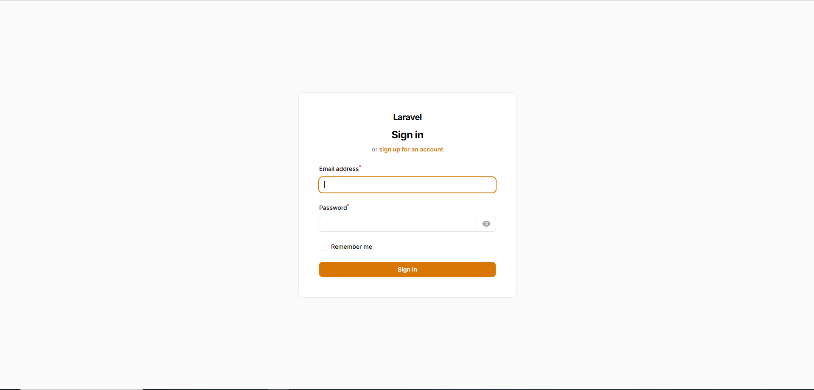
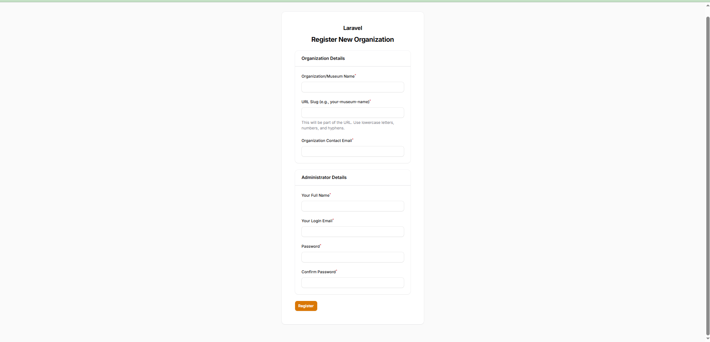
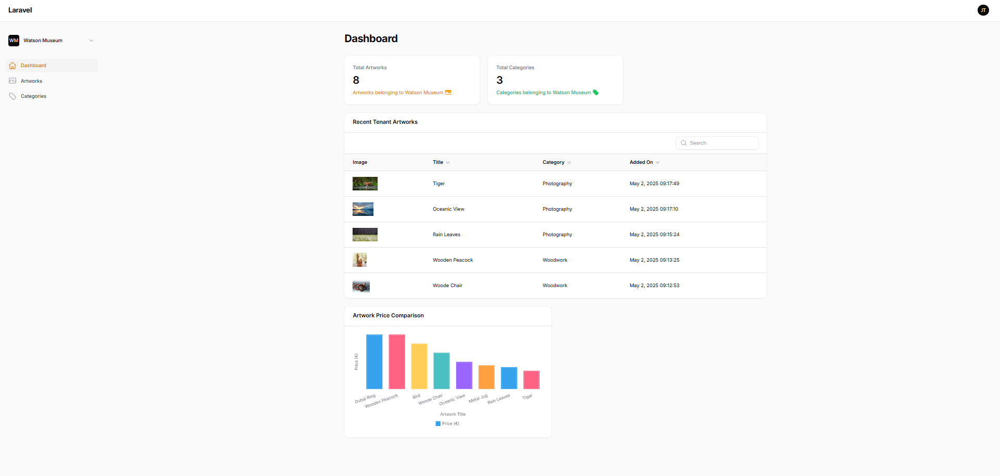
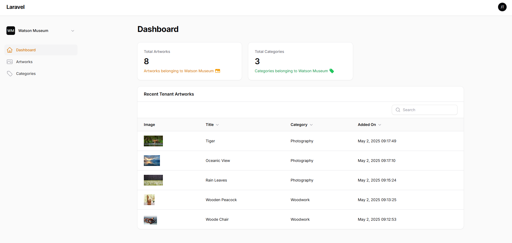
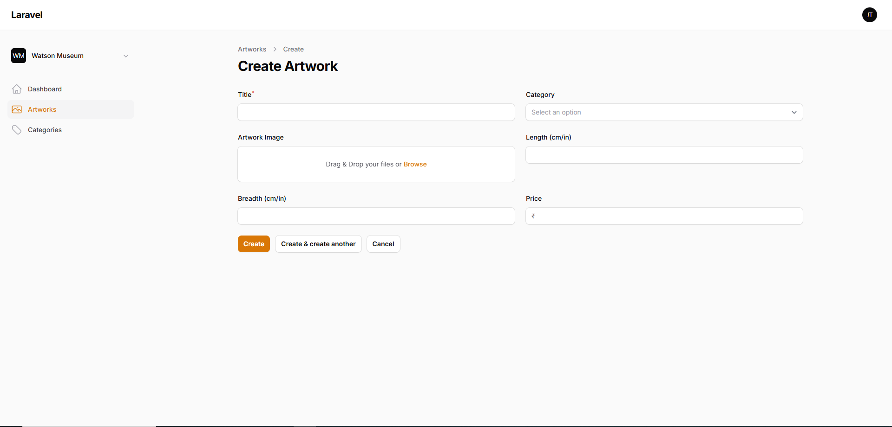
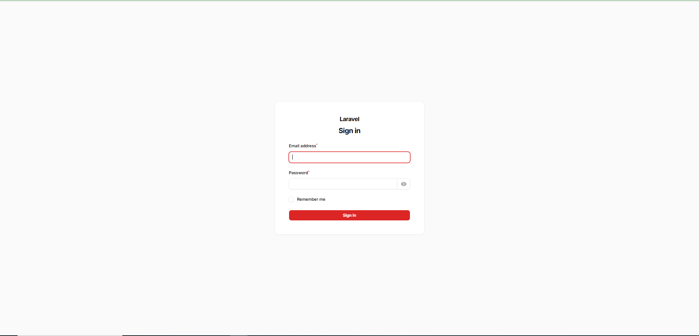
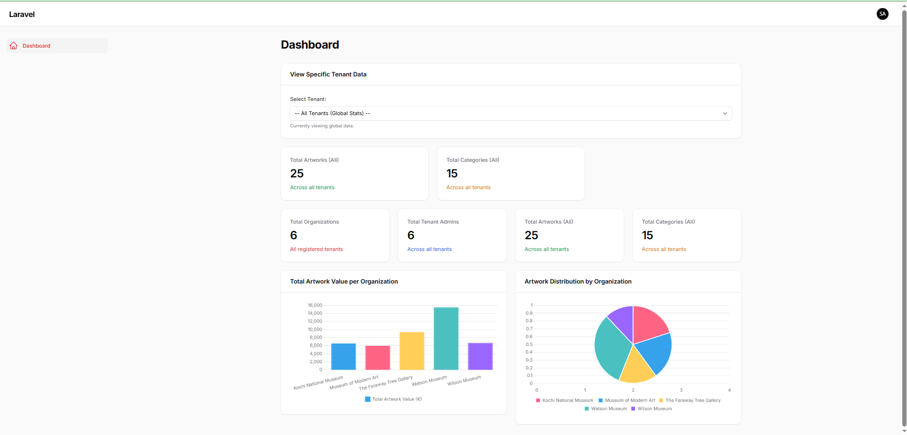
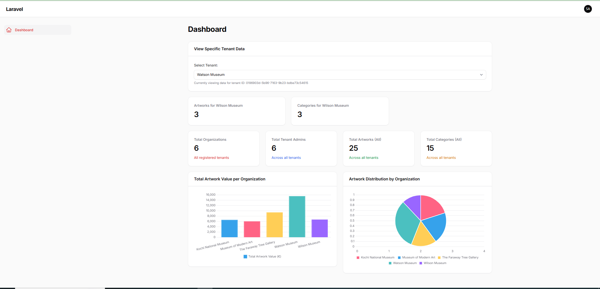

# 🖼️ Multi-Tenant Art Gallery (Filament Demo)

This project is a demonstration of building a multi-tenant application using Laravel 11 and Filament v3. It simulates an art gallery platform where different organizations (Museums) can register and manage their own artworks and categories through a dedicated admin panel, while a Super Admin can oversee the entire system using a separate panel.

This demo utilizes a **shared database** approach with tenant isolation achieved via `tenant_id` columns.

---

## 🚀 Features

**Tenant Admin Panel (`/admin`):**
*   🔐 **Secure Tenant Login:** Dedicated login for administrators of specific organizations (`TenantAdmin` model).
*   🖼️ **Artwork Management:** Full CRUD operations for artworks belonging *only* to the logged-in tenant.
*   🏷️ **Category Management:** Full CRUD operations for categories belonging *only* to the logged-in tenant.
*   📊 **Tenant Dashboard:** Displays statistics and charts relevant *only* to the tenant's data (Total Artworks, Category Distribution Pie Chart, Price Distribution Line Chart, Category Value Pie Chart).
*   🏢 **Automatic Scoping:** Resources and data are automatically filtered based on the current tenant context.

**Super Admin Panel (`/superadmin`):**
*   👑 **Secure Super Admin Login:** Separate login for system administrators (`User` model with `is_super_admin` flag).
*   🌍 **Global Overview:** Dashboard widgets summarizing key information across *all* tenants (Total Organizations, Total Tenant Admins, Total Artworks, Total Categories, Value/Distribution Charts).
*   🔍 **Tenant Context Switching:** A dropdown allows the Super Admin to select a specific tenant and view contextual stats, charts, and recent artworks for *just that tenant* on the dashboard.
*   **(Optional) User/Tenant Management:** Can be extended with Filament Resources to allow Super Admins to manage Tenants and potentially Tenant Admins directly (not explicitly implemented in this base demo).

**General:**
*   🏢 **Multi-Tenancy (Shared DB):** Demonstrates the shared database model with `tenant_id` scoping.
*   ✍️ **Tenant Self-Registration:** Organizations can register themselves and create their initial admin user via `/admin/register`.
*   ⚡ **Modern Stack:** Built with Laravel 11 & PHP 8.2+.
*   🎨 **Admin UI:** Clean and efficient admin interfaces powered by Filament v3.
*   📱 **Responsive Design:** Accessible on various devices.
*   🔑 **UUIDs:** Uses UUIDs for primary keys where appropriate (`tenants`, `tenant_admins`, `artworks`).

---

## 🏗️ Tech Stack

*   **Framework**: Laravel 11 (PHP 8.2+)
*   **Admin Panel**: Filament v3 (Panels, Forms, Tables, Widgets, Actions, Infolists)
*   **Database**: MySQL / PostgreSQL (Configurable)
*   **Frontend (Admin)**: Livewire, Alpine.js (via Filament)
*   **Styling**: Tailwind CSS (via Filament)
*   **Asset Bundling**: Vite

---

## 📸 Screenshots

<!-- Create a directory like .github/images/ or docs/images/ -->
<!-- Add your screenshots and update the paths below -->
### 🔑 Tenant Admin Login


### ✍️ Tenant Registration 


### 📊 Tenant Admin Dashboard 


### 🖼️ Tenant Artwork Category Management 


### 🖼️ Tenant Artwork Management 


### 🖼️ Tenant Artwork Management 


### 🔒 Super Admin Login (`/superadmin/login`)


### 🌍 Super Admin Dashboard (`/superadmin` - Global View)


### 🏢 Super Admin Dashboard (Tenant Selected)


---

## 🛠️ Installation

1.  **Clone the repository:**
    ```bash
    git clone https://github.com/[your-username]/[your-repo-name].git multi-tenant-gallery
    cd multi-tenant-gallery
    ```

2.  **Install PHP Dependencies:**
    ```bash
    composer install
    ```

3.  **Install Node.js Dependencies & Build Assets:**
    ```bash
    npm install
    npm run build # Or use 'npm run dev' for development
    ```

4.  **Set up Environment File:**
    ```bash
    cp .env.example .env
    php artisan key:generate
    ```

5.  **Configure Environment (`.env` file):**
    Open the `.env` file and update:
    *   `DB_CONNECTION`, `DB_HOST`, `DB_PORT`, `DB_DATABASE`, `DB_USERNAME`, `DB_PASSWORD` for your database setup.
    *   `APP_URL` for your local development environment (e.g., `APP_URL=http://localhost:8000`).

    ```env
    APP_NAME="Multi-Tenant Gallery"
    APP_ENV=local
    APP_KEY=base64:... # Should be generated
    APP_DEBUG=true
    APP_URL=http://localhost:8000 # Set correctly

    DB_CONNECTION=mysql
    DB_HOST=127.0.0.1
    DB_PORT=3306
    DB_DATABASE=museum # Or your chosen DB name
    DB_USERNAME=root
    DB_PASSWORD= # Your password
    ```

6.  **Create Database:** Manually create the database specified in `DB_DATABASE` using your preferred database tool.

7.  **Run Database Migrations & Seed:**
    This command drops existing tables, runs all migrations (including adding `is_super_admin` to `users`), and executes `DemoDataSeeder` to create sample tenants, tenant admins, categories, and the super admin user.
    ```bash
    php artisan migrate:fresh --seed
    ```
    *(Warning: `migrate:fresh` deletes all data!)*

8.  **Link Storage:**
    Makes uploaded images publicly accessible.
    ```bash
    php artisan storage:link
    ```

9.  **Serve the Application:**
    ```bash
    php artisan serve
    ```
    Access the application at the URL provided (usually `http://localhost:8000`).

---

## ✨ Usage

1.  **Tenant Registration:**
    *   Go to `/admin/register`.
    *   Fill in organization details, admin details, and password.
    *   On success, you'll be logged in as the new Tenant Admin and redirected to `/admin`.

2.  **Tenant Admin Login:**
    *   Go to `/admin/login`.
    *   Log in with credentials created during registration or seeded data:
        *   `alice@moma.example.com` / `password`
        *   `bob@nationalgallery.example.com` / `password`
    *   The dashboard and resources (Artworks, Categories) will show data only for that tenant.

3.  **Super Admin Login:**
    *   Go to `/superadmin/login`.
    *   Log in with seeded credentials:
        *   `superadmin@example.com` / `password`
    *   The dashboard shows global stats and a tenant selector. Use the selector to view data for specific tenants within the contextual widgets.

---

## 📁 Project Structure (Key Filament & App Areas)

```text
.
├── app
│   ├── Console
│   ├── Exceptions
│   ├── Filament                 # 'admin' panel components
│   │   ├── Pages
│   │   │   └── RegisterTenant.php
│   │   ├── Resources
│   │   │   ├── ArtworkResource
│   │   │   │   └── Pages
│   │   │   │       ├── CreateArtwork.php
│   │   │   │       ├── EditArtwork.php
│   │   │   │       └── ListArtworks.php
│   │   │   ├── ArtworkResource.php
│   │   │   ├── CategoryResource
│   │   │   │   └── Pages
│   │   │   │       ├── CreateCategory.php
│   │   │   │       ├── EditCategory.php
│   │   │   │       └── ListCategories.php
│   │   │   └── CategoryResource.php
│   │   └── Widgets              # 'admin' panel widgets
│   │       ├── TenantArtworkStat.php
│   │       ├── TenantCategoryChart.php
│   │       ├── TenantCategoryValueChart.php
│   │       └── TenantPriceChart.php
│   ├── Http
│   │   ├── Controllers
│   │   └── Middleware
│   ├── Models                   # Eloquent Models
│   │   ├── Artwork.php
│   │   ├── Category.php
│   │   ├── Tenant.php
│   │   ├── TenantAdmin.php
│   │   └── User.php             # (Super Admin)
│   ├── Policies
│   ├── Providers
│   │   ├── Filament               # Panel Providers
│   │   │   ├── AdminPanelProvider.php
│   │   │   └── SuperadminPanelProvider.php
│   │   └── (...)                # Other Service Providers
│   └── Superadmin               # 'superadmin' panel components
│       ├── Pages                # (Empty unless custom pages added)
│       ├── Resources            # (Empty unless resources added)
│       └── Widgets              # 'superadmin' panel widgets
│           ├── CategoryDistributionChart.php
│           ├── ContextualRecentArtworks.php
│           ├── ContextualStatsOverview.php
│           ├── GlobalStatsOverview.php
│           ├── TenantArtworkDistributionChart.php
│           ├── TenantSelector.php
│           └── TotalValuePerTenantChart.php
├── bootstrap
│   └── (...)
├── config
│   └── (...)
├── database
│   ├── factories
│   ├── migrations               # Database Migrations
│   │   ├── 0001_01_01_000000_create_users_table.php
│   │   ├── ..._create_tenants_table.php
│   │   ├── ..._create_categories_table.php
│   │   ├── ..._create_tenant_admins_table.php
│   │   └── ..._create_artworks_table.php
│   └── seeders                  # Database Seeders
│       ├── DatabaseSeeder.php
│       └── DemoDataSeeder.php
├── public
│   ├── build
│   └── storage -> ../storage/app/public # Symlink
├── resources
│   ├── css
│   ├── js
│   └── views                    # Blade Views
│       ├── filament
│       │   ├── pages
│       │   │   └── register-tenant.blade.php
│       │   └── superadmin
│       │       └── widgets
│       │           └── tenant-selector.blade.php
│       └── welcome.blade.php
├── routes
│   ├── api.php
│   ├── channels.php
│   ├── console.php
│   └── web.php
├── storage
│   ├── app
│   │   └── public
│   │       └── artworks         # Uploaded artwork images
│   ├── framework
│   └── logs
├── tests
├── vendor
├── .env.example
├── .gitignore
├── artisan
├── composer.json
├── package.json
├── phpunit.xml
├── vite.config.js
└── README.md                    # This file!


```


## 🤝 Contributing
Pull requests are welcome. For major changes, please open an issue first to discuss what you would like to change.
Fork the Project
Create your Feature Branch (git checkout -b feature/AmazingFeature)
Commit your Changes (git commit -m 'Add some AmazingFeature')
Push to the Branch (git push origin feature/AmazingFeature)
Open a Pull Request

## 📄 License
Distributed under the MIT License. See LICENSE file for more information.
